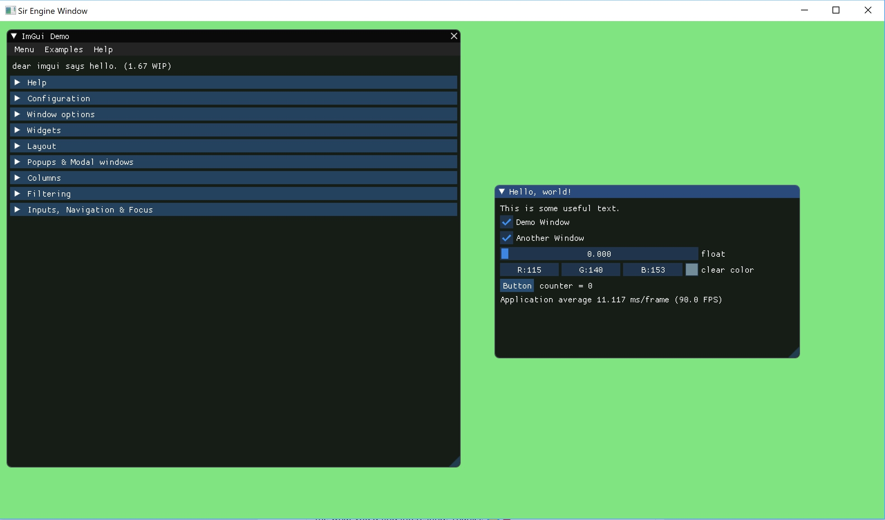
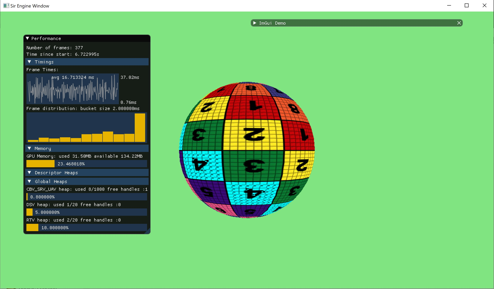
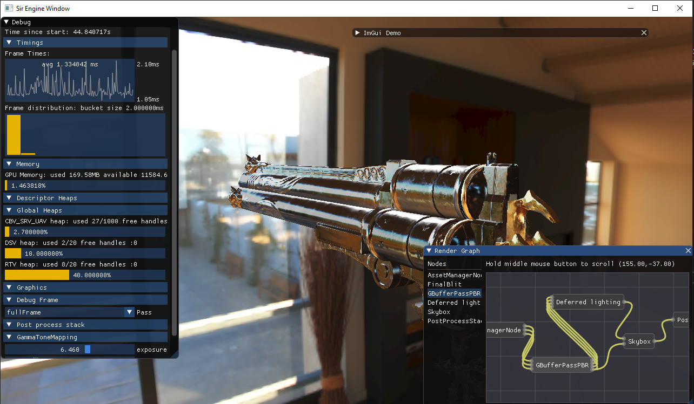
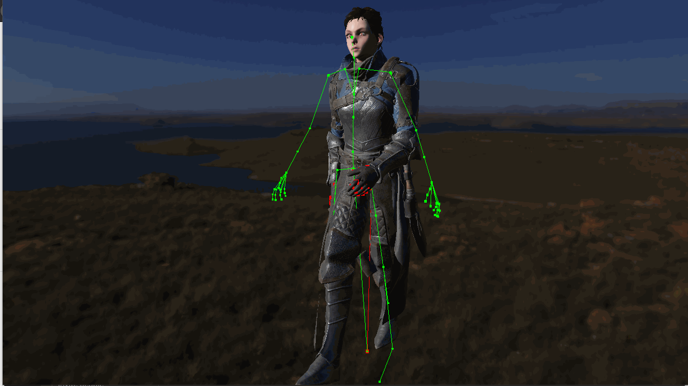
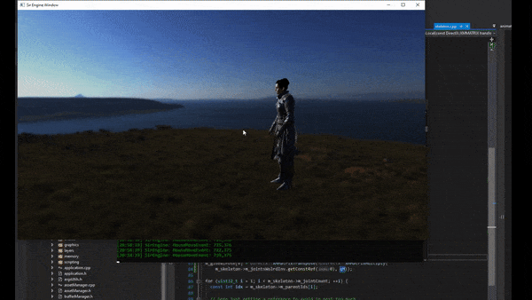
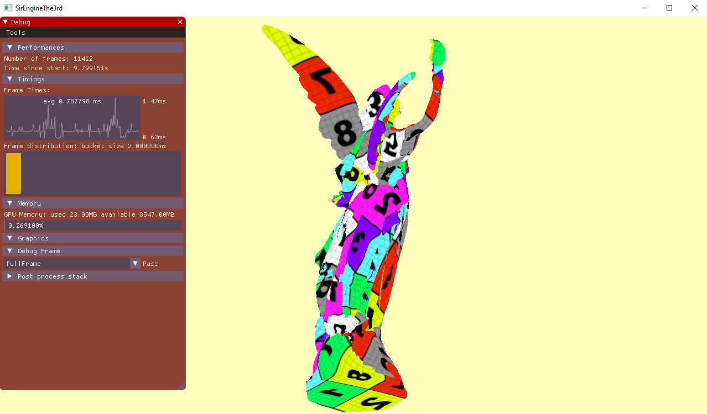
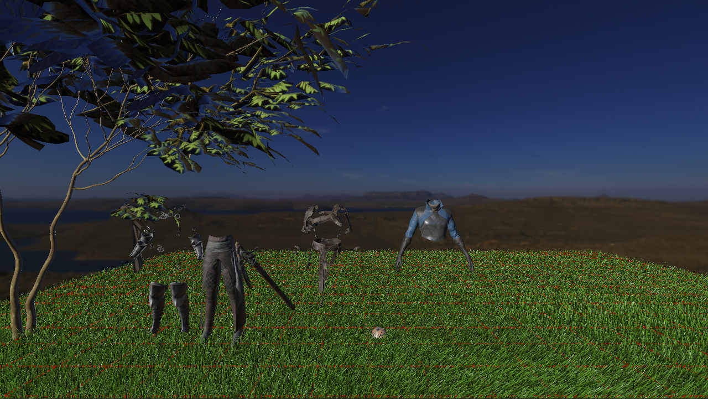

# Sir Engine the 3rd [](https://github.com/giordi91/SirEngineThe3rd/actions) 


*TRELLO BOARD*: https://trello.com/b/iMSdavzF/sirenginethe3rd 


A dx12 game engine (kind of).

Initially inspired by The Cherno project game engine series: https://www.youtube.com/user/TheChernoProject before going my own way. The series is pretty cool, check it out!

This is my attempt to a dx12 engine, this is my third iteration to a so called engine. 
My first one was a poor Opengl viewport, then a more serious approach to a dx11 engine, but mostly geared toward getting stuff on screen quickly. 
Finally this is my third attempt trying to use dx12. 

It is my pleasure to introduce you to Sir Engine, the 3rd of his name.

Here a I will keep a chronological list of the progress:

##### Table of Contents  
[0.1.0: basic window](#v010)  
[0.2.0: basic engine arch](#v020)  
[0.3.0: PBR shader](#v030)  
[0.4.0: Fully skinned character](#v040)  
[0.5.0: Scripted character animation](#v050)  
[0.6.0: VK port PT 1](#v060)  
[0.7.0: VK port PT 2 and grass](#v070)  
[0.7.1: Material system ](#v071)  

## 0.1.0 <a name="v010"/>
This version is the most basic version of the engine, but starts to put togheter the foundation of the engine:
* Event system
* Layer stack
* Imgui
* Dx12 init
* Swap chain resize and clear color
* Started basic resource compiler for meshes

More info on resource compiler here:
https://giordi91.github.io/post/resource_compiler/



## 0.2.0 <a name="v020"/>
This next version of the engine adds the major facilities of the engine arch, render
loop is still hard-coded and will come in 0.3.0, added features:
* Asset managers, with concept of identity for an asset
* Several managers to allocated resources and keep track of it
* Initial memory layout, intended fast path for rendering, anything custom will be off the fast path
* A lot of work on ResourceCompiler, everything that could be compiled is using the compiler textures include
* Now assets can be rendered in a simple way, without knowing how many you have upfront etc.

More info on this new system here:
link-coming-soon



## 0.3.0 <a name="v030"/>
This main goal of this version was to give a first good crack at the graphics: features:
* PBR shader
* basic workflow for the needed textures in a PBR shader
* Added mip map generation of textures in the compiler to reduce aliasing
* Basic rendering graph
* AMD work to fetch data out of the card like core freq etc



## 0.4.0 <a name="v040"/>
The main goal of this release was to get a full character in, this required several shader
to be created for the head, and animation skinning implementation.
Features:
* Screen space subsurface scattering, basic implementation, required extension to use stencil
* Alpha cut out for hair, added forward pass to support transparen shader
* Added animation import and evaluation, (compiler plugin to compile animations)
* Added debug renderer to debug skeletons
* Added skincluster shaders and matrices upload
* Skinning required refactoring of the whole buffer management



## 0.5.0 <a name="v050"/>
The main goal of this release was to being able to move the character around using input,
to do so, I did not want hardcoded state machine so a scripting solution was needed.
Features:
* Added Lua scripting support
* Automatic or manual execution of Lua scripts
* Reworked animation manager to support multiple animation blending
* Extensible animation player architecture, for example simpleLoopPlayer and luaPlayer
* Lua state machine
* Heavy refactoring of the engine to support the new feature, removed a lot of the STL data structure
* Added custom hashmaps and string hashmaps
* Animation resources are now pre compiled by resource compiler



## 0.6.0 <a name="v060"/>
The main goal of this release was beging to focus on Vulkan and AMD hardware. 
I have started doing a lot of work to port the dx12 engine to Vulkan.

* Initial code drop from stand alone vulkan viewport
* Glsl lang compiler integration and plugin for resource compiler
* Reading and creating Pipeline layout, RenderPass and Grapich Pipeline from json files
* Added use of immutable samplers to emulate dx12 static samplers
* added imgui 
* reworked engine config to easily change between dx12/vulkan and pick adapter vendor
* removed usage of DirectXMath in favor of GLM, reworked animation system and camera
* working camera in VK
* updated imgui to latest



** Run the compiler **
```
C:\WORK_IN_PROGRESS\C\directX\SirEngineThe3rd\build2019>cd bin\release && ResourceCompiler.exe -e ../data/executeFullDeb
ug.json && cd ../..
```

## 0.7.0 <a name="v070"/>
This release was a huge push in the Vulkan back end and cleanup.

* Rewritten binding system by using "BindingTables" that allowed generic cross platform bindings, only some system use it. Will propagate over time
* Added vulkan skybox, post processing and full pbr shader.
* Added grass shader in both vk and dx12
* Rewritten completely DebugRenderer, now based on slabs that needs to be filled every frame, much simpler and cross platform
* Written a GPU Slab allocator that sits on top of a cleaned up and enanched buffer menager. This allows to move a lot of stuff from being API specific to be API agnostic (like the DebugRenderer). Other system will follow soon
* Introduced Main and Active camera to start working on debugging culling.


## 0.7.1 <a name="v071"/>
This release was mostly focused on the new material system building on top of BindingTables.

* Added material metadata, extracted from the shaders using SPIRV-cross
* From material metadata root signatures can be automatically generated
* From metadata binding tables can be generated and asset resources automatically bound
* Added use of push constants/root constants support for fast matrix look up in shader

Image showing push constant in place allowing to use a different matrix per object


***Credits***

Copyright (c) 2010-2016 Richard Geldreich, Jr., Tenacious Software, and Binomial LLC
